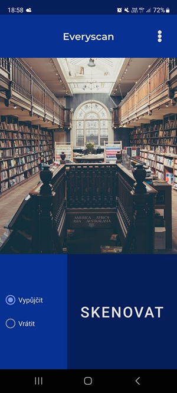
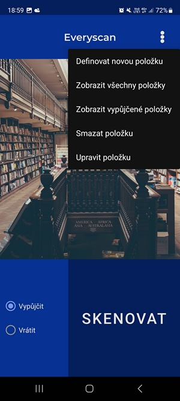
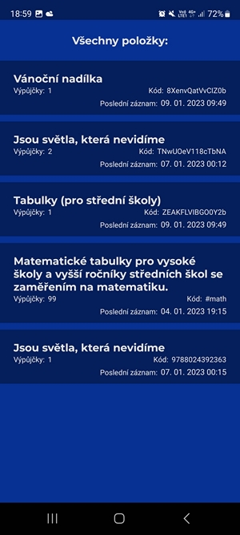
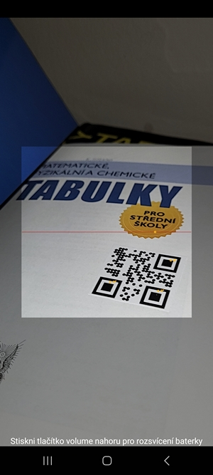

# Everyscan

### Zadání:
- Vytvořte mobilní aplikaci na téma vlastního výběru, splňte následující podmínky:
- Použití architektury MVVM  
- Grafická část aktivity bude počítat s otočením, přepnutím do nočního režimu   
- Použití recycler view
- Načítání a ukládání dat do databáze nebo JSON souboru

### Popis aplikace Everyscan:
Aplikace slouží ke správě výpůjček čehokoli, co lze opatřit čárovým nebo QR kódem. Například knihy s ISBN nebo DVD.
S využitím knihovny ZXing pro načítání QR nebo čárového kódu aplikace tyto kódy načítá a spravuje.
Při práci s uloženými položkami je splněn požadavek CRUD, položky tedy lze upravovat, mazat, zobrazovat a vytvářet.

Aplikace:
- kontroluje korektnost uživatelských vstupů
- dodržuje architekturu MVVM
- jde používat v horizontálním režimu
- ukládá data lokálně do JSON souboru
- je uživatelsky přívětivá

### IDE
Android Studio Dolphin | 2021.3.1 Patch 1

### Screenshoty:

